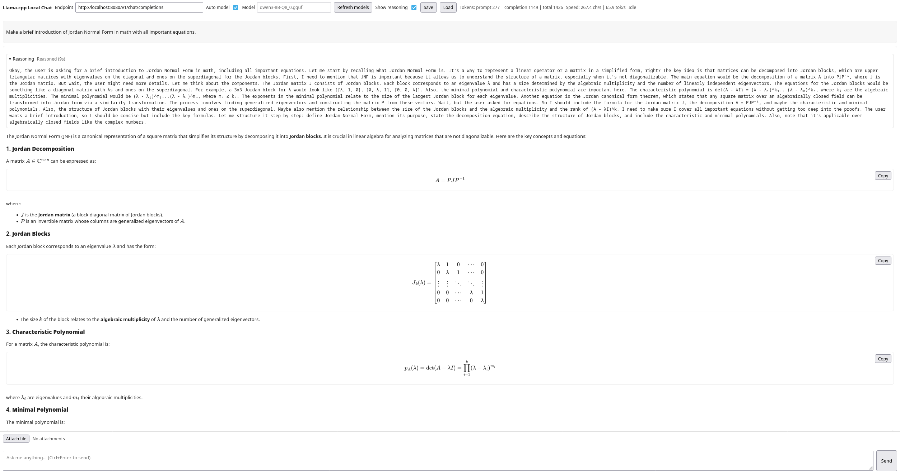
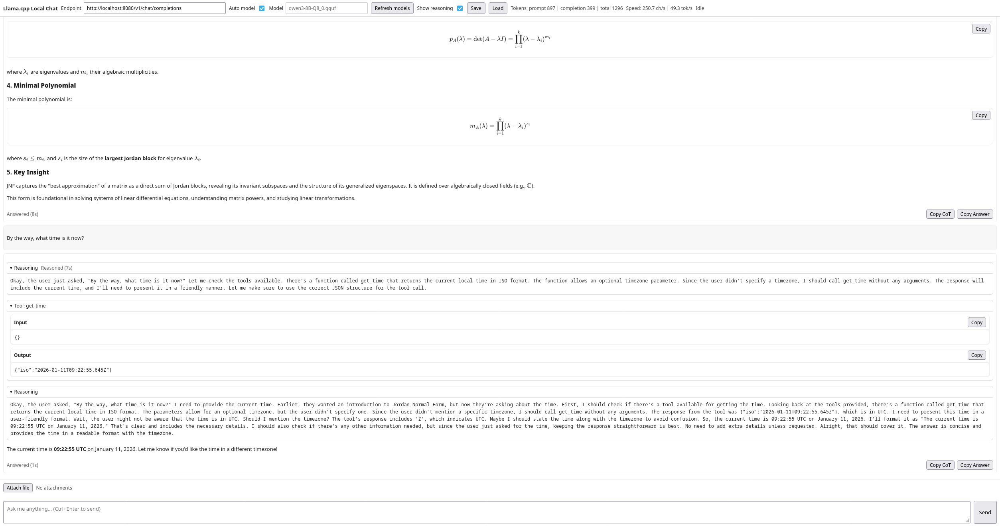

# Overview

LlamaChatUI is a web-based interface for interacting with a local language model using the openai completion API. It supports streaming responses, Markdown formatting, MathJax for rendering mathematical expressions, and reasoning content. The application allows users to send prompts, receive responses, and manage attachments.

It also supports a few tools by openai-style tool functions, adjustment needed for more tools integration. See `assets/js/tools.js` for more.

# Key Features

- **Streaming Responses**: Real-time updates for long-form responses.
- **Markdown Support**: Rich text formatting for better readability.
- **MathJax Integration**: Rendering of mathematical expressions in text.
- **Reasoning Content**: Display of the model's thought process.
- **Attachment Management**: Attach and send files with prompts.

# Motivation

The project aims to provide a user-friendly interface for interacting with Llama.cpp hosted local large language model. It simplifies the process of sending prompts, receiving responses, and managing attachments, making it accessible for personal use. It is also a minimal useable implementation without using any web framework.

# Dependencies

- **MathJax**: For rendering mathematical expressions.
- **Marked**: For Markdown parsing.
- **DOMPurify**: For sanitizing HTML content.
- **Fetch API**: For making HTTP requests to the Llama.cpp API.

# Usage

Serve the page with `npx serve .` or anything else you like, then enjoy.

# Screenshots

